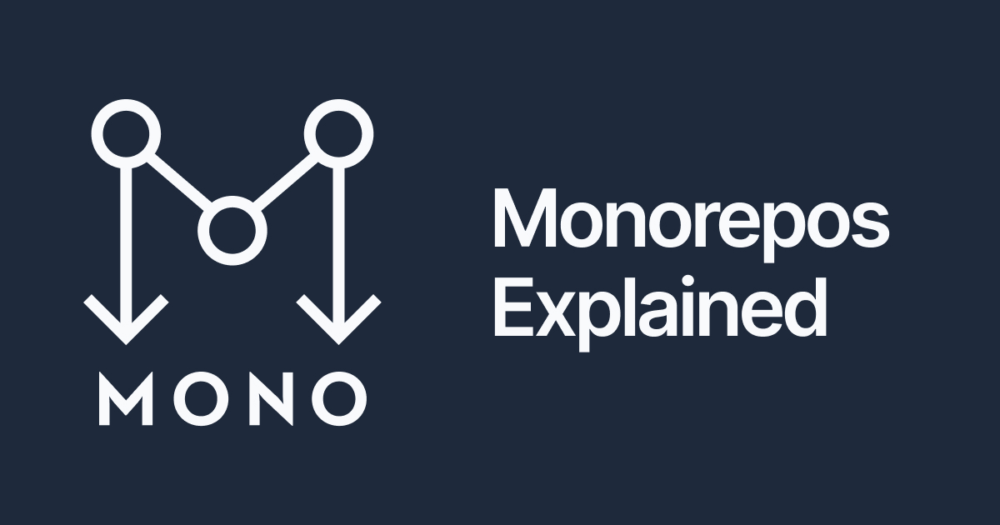

<p><a href="https://monorepo.tools" target="_blank" rel="noreferrer" title="Monorepo.tools"></a></p>

# Monorepo.tools

Monorepos are hot right now, especially among Web developers. We created this resource to help developers understand what monorepos are, what benefitsthey can bring, and the tools available to make monorepo development delightful.

There are many great monorepo tools, built by great teams, with different philosophies. We do our best to represent each tool objectively, and we welcome pull requests if we got something wrong!

The tools we'll focus on are: Bazel (by Google),  Lage (by Microsoft),  Lerna, Nx (by Nrwl), Rush (by Microsoft), and Turborepo (by Vercel). We chose these tools because of their usage or recognition in the Web development community.

## Development

This project was generated using [Nx](https://nx.dev), check [Nx's documentation to know more](https://nx.dev/getting-started/intro).

### Running locally

To run monorepo.tools locally, run the following command:

```bash
nx serve website
# Same as
nx run website:serve
```

## Contributing

See [contributing document](./CONTRIBUTING.md).
